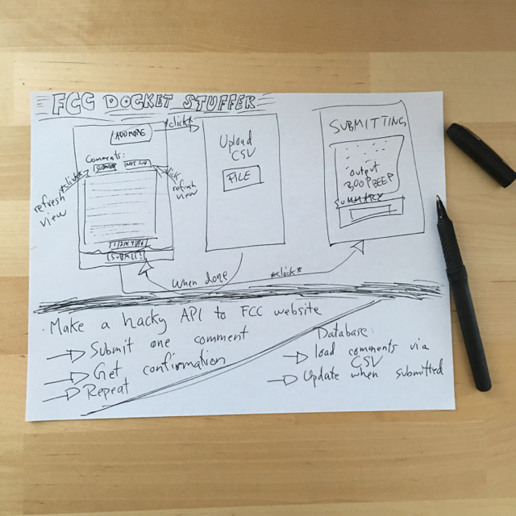

# stuffer
fcc docket stuffer

Architecture:
* an API that accepts FCC comments, puts them in a database 
* a backend script that reads the database and for each comment runs a script that posts the comment to the FCC website
* a "frontend" app (probably electron) allows someone to bulk upload comments to the API via CSV

rough work plan:
 * make the API first - Roughly
 * make a script that posts one comment - Done!
 * then build an interface for sending bulk comments to the API that will be queued to be sent to FCC individually using the script above - I'm here now
